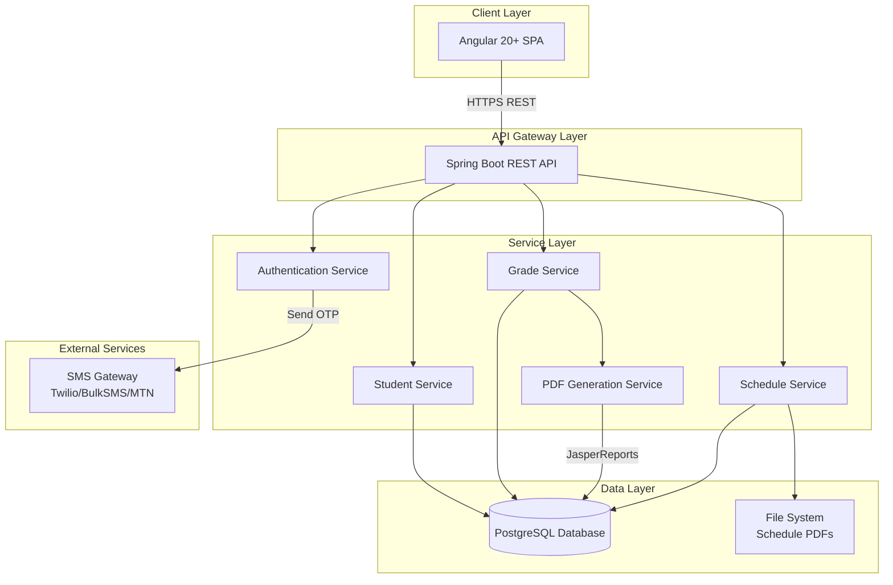
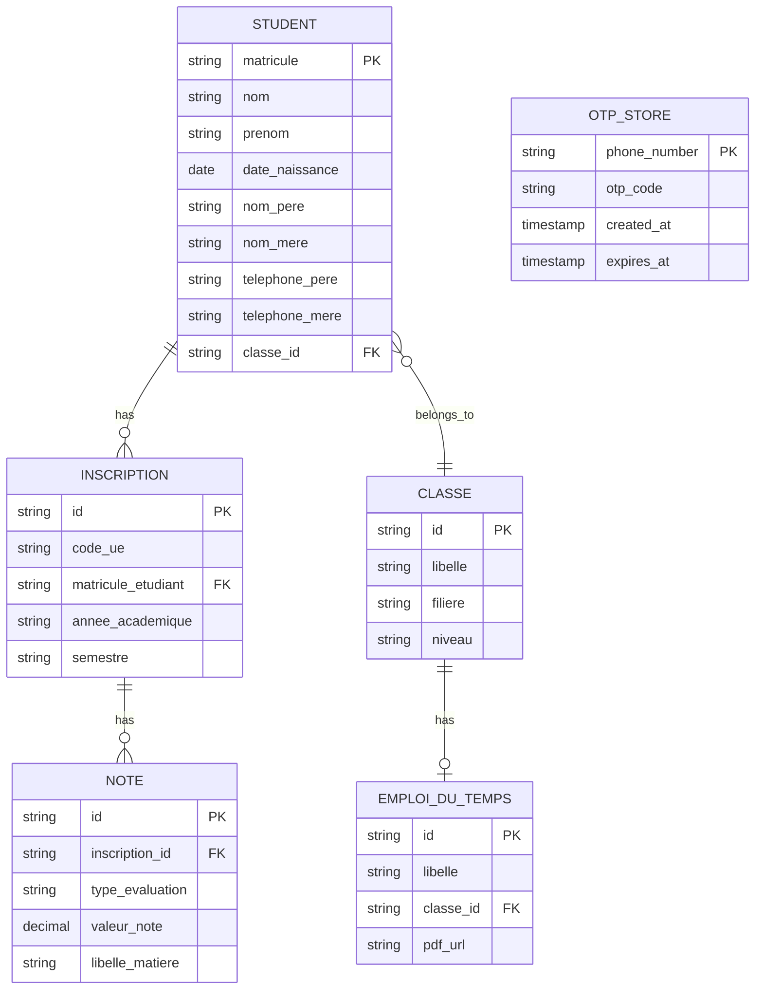
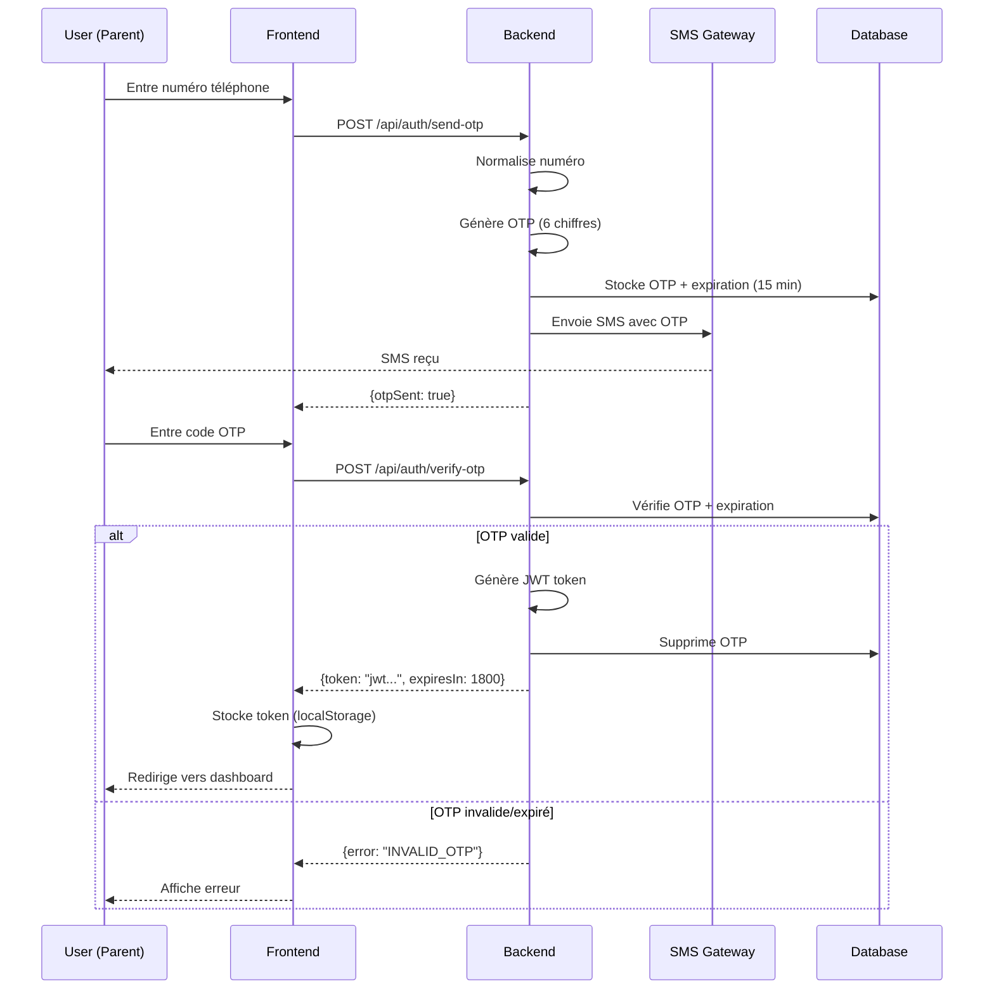

# Design Document - Plateforme de Suivi Académique Parents-Établissement

## Overview

La Plateforme de Suivi Académique est une application web full-stack composée d'un frontend Angular 20+ et d'un backend Spring Boot. L'architecture suit le pattern MVC côté backend et une architecture par composants côté frontend. Le système utilise une authentification sans mot de passe basée sur OTP SMS, particulièrement adaptée au contexte camerounais.

### Key Design Principles

- **Security First**: Authentification OTP, sessions sécurisées, HTTPS obligatoire
- **Simplicity**: Interface utilisateur minimaliste centrée sur 3 actions principales (login, voir notes, voir emploi du temps)
- **Performance**: Génération PDF asynchrone, mise en cache des données fréquemment consultées
- **Scalability**: Architecture REST stateless, possibilité de scaling horizontal
- **Maintainability**: Séparation claire des responsabilités, code modulaire

## Architecture

### High-Level Architecture



### Technology Stack

**Frontend:**
- Angular 20+ (TypeScript)
- Angular Material / Bootstrap pour l'UI
- RxJS pour la gestion asynchrone
- Angular Router pour la navigation
- HttpClient pour les appels API

**Backend:**
- Spring Boot 3.x (Java 17+)
- Spring Security pour l'authentification/autorisation
- Spring Data JPA pour l'accès aux données
- JasperReports pour la génération PDF
- Twilio SDK (ou équivalent) pour SMS

**Database:**
- PostgreSQL 15+ (relationnel)
- Flyway pour les migrations

**Infrastructure:**
- HTTPS/TLS pour toutes les communications
- JWT pour la gestion des sessions
- File system local pour les PDFs d'emploi du temps

## Components and Interfaces

### Frontend Components (Angular)

#### 1. Authentication Module

**LoginComponent**
- Formulaire de saisie du numéro de téléphone
- Bouton "Envoyer le code"
- Gestion des erreurs (numéro invalide, service SMS indisponible)

```typescript
interface LoginRequest {
  phoneNumber: string;
}

interface LoginResponse {
  message: string;
  otpSent: boolean;
}
```

**OtpVerificationComponent**
- Formulaire de saisie du code OTP (6 chiffres)
- Timer de 15 minutes avec affichage du temps restant
- Bouton "Renvoyer le code"
- Redirection vers dashboard après validation

```typescript
interface OtpVerificationRequest {
  phoneNumber: string;
  otpCode: string;
}

interface OtpVerificationResponse {
  token: string;
  expiresIn: number;
}
```

#### 2. Student Dashboard Module

**StudentListComponent**
- Affichage de la liste des enfants du parent
- Card pour chaque étudiant avec photo (optionnel), nom, prénom, classe
- Boutons "Notes" et "Emploi du temps"

```typescript
interface Student {
  matricule: string;
  nom: string;
  prenom: string;
  dateNaissance: Date;
  classe: ClassInfo;
}

interface ClassInfo {
  libelle: string;
  filiere: string;
  niveau: string;
}
```

#### 3. Services (Angular)

**AuthService**
- `sendOtp(phoneNumber: string): Observable<LoginResponse>`
- `verifyOtp(phoneNumber: string, otp: string): Observable<OtpVerificationResponse>`
- `logout(): void`
- `isAuthenticated(): boolean`
- `getToken(): string`

**StudentService**
- `getMyChildren(): Observable<Student[]>`

**GradeService**
- `downloadGradeReport(matricule: string): Observable<Blob>`

**ScheduleService**
- `downloadSchedule(classeId: string): Observable<Blob>`

#### 4. Guards and Interceptors

**AuthGuard**
- Protège les routes nécessitant une authentification
- Redirige vers login si pas de token valide

**AuthInterceptor**
- Ajoute le JWT token dans les headers de toutes les requêtes
- Gère les erreurs 401 (token expiré)

### Backend Components (Spring Boot)

#### 1. Controllers (REST API)

**AuthController** (`/api/auth`)
- `POST /send-otp` - Envoie un code OTP
- `POST /verify-otp` - Vérifie le code et retourne un JWT
- `POST /logout` - Invalide la session

**StudentController** (`/api/students`)
- `GET /my-children` - Retourne la liste des enfants du parent authentifié

**GradeController** (`/api/grades`)
- `GET /{matricule}/report` - Génère et retourne le PDF des notes

**ScheduleController** (`/api/schedules`)
- `GET /class/{classeId}` - Retourne le PDF de l'emploi du temps

#### 2. Services (Business Logic)

**AuthenticationService**
```java
public interface AuthenticationService {
    void sendOtp(String phoneNumber);
    String verifyOtp(String phoneNumber, String otpCode);
    void invalidateSession(String token);
}
```

**PhoneNumberNormalizationService**
```java
public interface PhoneNumberNormalizationService {
    List<String> normalizeAndSplit(String phoneNumbers);
    boolean matches(String inputPhone, String storedPhones);
}
```

**OtpService**
```java
public interface OtpService {
    String generateOtp();
    void storeOtp(String phoneNumber, String otp, int validityMinutes);
    boolean validateOtp(String phoneNumber, String otp);
    void invalidateOtp(String phoneNumber);
}
```

**SmsService**
```java
public interface SmsService {
    void sendSms(String phoneNumber, String message);
}
```

**StudentService**
```java
public interface StudentService {
    List<Student> findStudentsByParentPhone(String phoneNumber);
    Student findByMatricule(String matricule);
}
```

**GradeService**
```java
public interface GradeService {
    List<Grade> findGradesByStudent(String matricule);
}
```

**PdfGenerationService**
```java
public interface PdfGenerationService {
    byte[] generateGradeReport(String matricule);
}
```

**ScheduleService**
```java
public interface ScheduleService {
    byte[] getSchedulePdf(String classeId);
}
```

#### 3. Security Configuration

**JWT Token Structure**
```json
{
  "sub": "670000000",
  "role": "PARENT",
  "iat": 1709856000,
  "exp": 1709857800
}
```

**SecurityConfig**
- Endpoints publics: `/api/auth/**`
- Endpoints protégés: `/api/students/**`, `/api/grades/**`, `/api/schedules/**`
- JWT validation sur chaque requête
- CORS configuration pour Angular frontend

## Data Models

### Database Schema



### JPA Entities

**Student Entity**
```java
@Entity
@Table(name = "student")
public class Student {
    @Id
    private String matricule;
    
    private String nom;
    private String prenom;
    
    @Column(name = "date_naissance")
    private LocalDate dateNaissance;
    
    @Column(name = "nom_pere")
    private String nomPere;
    
    @Column(name = "nom_mere")
    private String nomMere;
    
    @Column(name = "telephone_pere")
    private String telephonePere;  // Format: "670000000/690000000"
    
    @Column(name = "telephone_mere")
    private String telephoneMere;
    
    @ManyToOne
    @JoinColumn(name = "classe_id")
    private Classe classe;
    
    @OneToMany(mappedBy = "student")
    private List<Inscription> inscriptions;
}
```

**Classe Entity**
```java
@Entity
@Table(name = "classe")
public class Classe {
    @Id
    @GeneratedValue(strategy = GenerationType.UUID)
    private String id;
    
    private String libelle;
    private String filiere;
    private String niveau;
    
    @OneToMany(mappedBy = "classe")
    private List<Student> students;
    
    @OneToOne(mappedBy = "classe")
    private EmploiDuTemps emploiDuTemps;
}
```

**Inscription Entity**
```java
@Entity
@Table(name = "inscription")
public class Inscription {
    @Id
    @GeneratedValue(strategy = GenerationType.UUID)
    private String id;
    
    @Column(name = "code_ue")
    private String codeUe;
    
    @ManyToOne
    @JoinColumn(name = "matricule_etudiant")
    private Student student;
    
    @Column(name = "annee_academique")
    private String anneeAcademique;
    
    private String semestre;
    
    @OneToMany(mappedBy = "inscription")
    private List<Note> notes;
}
```

**Note Entity**
```java
@Entity
@Table(name = "note")
public class Note {
    @Id
    @GeneratedValue(strategy = GenerationType.UUID)
    private String id;
    
    @ManyToOne
    @JoinColumn(name = "inscription_id")
    private Inscription inscription;
    
    @Column(name = "type_evaluation")
    @Enumerated(EnumType.STRING)
    private TypeEvaluation typeEvaluation;  // CC, SN, TP, RAT
    
    @Column(name = "valeur_note")
    private BigDecimal valeurNote;
    
    @Column(name = "libelle_matiere")
    private String libelleMatiere;
}
```

**EmploiDuTemps Entity**
```java
@Entity
@Table(name = "emploi_du_temps")
public class EmploiDuTemps {
    @Id
    @GeneratedValue(strategy = GenerationType.UUID)
    private String id;
    
    private String libelle;
    
    @OneToOne
    @JoinColumn(name = "classe_id")
    private Classe classe;
    
    @Column(name = "pdf_url")
    private String pdfUrl;
}
```

**OtpStore Entity** (pour stockage temporaire)
```java
@Entity
@Table(name = "otp_store")
public class OtpStore {
    @Id
    @Column(name = "phone_number")
    private String phoneNumber;
    
    @Column(name = "otp_code")
    private String otpCode;
    
    @Column(name = "created_at")
    private LocalDateTime createdAt;
    
    @Column(name = "expires_at")
    private LocalDateTime expiresAt;
}
```

## Error Handling

### Frontend Error Handling

**Error Types**
- Network errors (pas de connexion)
- Authentication errors (OTP invalide, expiré)
- Authorization errors (token expiré)
- Server errors (500)
- Not found errors (404)

**Error Display Strategy**
- Toast notifications pour les erreurs non-critiques
- Modal dialogs pour les erreurs critiques nécessitant une action
- Inline validation messages pour les formulaires
- Redirection vers login si token expiré

### Backend Error Handling

**Global Exception Handler**
```java
@RestControllerAdvice
public class GlobalExceptionHandler {
    
    @ExceptionHandler(OtpExpiredException.class)
    public ResponseEntity<ErrorResponse> handleOtpExpired(OtpExpiredException ex) {
        return ResponseEntity.status(HttpStatus.UNAUTHORIZED)
            .body(new ErrorResponse("OTP_EXPIRED", "Le code a expiré. Veuillez demander un nouveau code."));
    }
    
    @ExceptionHandler(InvalidOtpException.class)
    public ResponseEntity<ErrorResponse> handleInvalidOtp(InvalidOtpException ex) {
        return ResponseEntity.status(HttpStatus.UNAUTHORIZED)
            .body(new ErrorResponse("INVALID_OTP", "Code invalide. Veuillez réessayer."));
    }
    
    @ExceptionHandler(StudentNotFoundException.class)
    public ResponseEntity<ErrorResponse> handleStudentNotFound(StudentNotFoundException ex) {
        return ResponseEntity.status(HttpStatus.NOT_FOUND)
            .body(new ErrorResponse("STUDENT_NOT_FOUND", "Étudiant non trouvé."));
    }
    
    @ExceptionHandler(UnauthorizedAccessException.class)
    public ResponseEntity<ErrorResponse> handleUnauthorizedAccess(UnauthorizedAccessException ex) {
        return ResponseEntity.status(HttpStatus.FORBIDDEN)
            .body(new ErrorResponse("UNAUTHORIZED", "Vous n'avez pas accès à ces informations."));
    }
    
    @ExceptionHandler(SmsServiceException.class)
    public ResponseEntity<ErrorResponse> handleSmsService(SmsServiceException ex) {
        return ResponseEntity.status(HttpStatus.SERVICE_UNAVAILABLE)
            .body(new ErrorResponse("SMS_SERVICE_ERROR", "Impossible d'envoyer le SMS. Veuillez réessayer."));
    }
}
```

**Error Response Format**
```json
{
  "code": "OTP_EXPIRED",
  "message": "Le code a expiré. Veuillez demander un nouveau code.",
  "timestamp": "2026-03-08T10:30:00Z"
}
```

## Testing Strategy

### Frontend Testing

**Unit Tests (Jasmine/Karma)**
- Services: AuthService, StudentService, GradeService, ScheduleService
- Components: LoginComponent, OtpVerificationComponent, StudentListComponent
- Guards: AuthGuard
- Interceptors: AuthInterceptor
- Coverage target: 70%

**E2E Tests (Cypress/Playwright)**
- Scénario complet: Login → Voir liste enfants → Télécharger notes → Télécharger emploi du temps
- Test d'expiration OTP
- Test de session expirée
- Test d'accès non autorisé

### Backend Testing

**Unit Tests (JUnit 5 + Mockito)**
- Services: AuthenticationService, PhoneNumberNormalizationService, OtpService, StudentService, GradeService
- Controllers: AuthController, StudentController, GradeController, ScheduleController
- Coverage target: 80%

**Integration Tests (Spring Boot Test)**
- Tests des repositories JPA
- Tests des endpoints REST avec MockMvc
- Tests de la génération PDF avec JasperReports
- Tests de l'intégration SMS (avec mock)

**Test Data**
- Utiliser des données de test réalistes (noms camerounais, numéros de téléphone locaux)
- Créer des fixtures pour les étudiants, classes, notes
- Scripts SQL pour initialiser la base de test

### Performance Testing

**Load Testing (JMeter/Gatling)**
- Test de charge: 100 parents simultanés
- Test de génération PDF: 50 rapports/minute
- Test d'authentification: 200 OTP/minute

**Performance Targets**
- Temps de réponse API: < 500ms (95th percentile)
- Génération PDF: < 10 secondes
- Envoi SMS: < 5 secondes

## Security Considerations

### Authentication Flow



### Authorization Strategy

**Phone Number Matching Logic**
```java
public boolean isAuthorizedToViewStudent(String authenticatedPhone, Student student) {
    List<String> fatherPhones = phoneNormalizer.normalizeAndSplit(student.getTelephonePere());
    List<String> motherPhones = phoneNormalizer.normalizeAndSplit(student.getTelephoneMere());
    
    String normalizedAuthPhone = phoneNormalizer.normalize(authenticatedPhone);
    
    return fatherPhones.contains(normalizedAuthPhone) || 
           motherPhones.contains(normalizedAuthPhone);
}
```

### Data Protection

**Sensitive Data**
- Numéros de téléphone: stockés en clair (nécessaires pour matching)
- OTP codes: hashés avec BCrypt avant stockage
- JWT tokens: signés avec clé secrète (HS256)
- Logs: masquage des numéros de téléphone (670***000)

**HTTPS Configuration**
- Certificat SSL/TLS obligatoire en production
- Redirection automatique HTTP → HTTPS
- HSTS headers

**CORS Configuration**
```java
@Configuration
public class CorsConfig {
    @Bean
    public CorsConfigurationSource corsConfigurationSource() {
        CorsConfiguration configuration = new CorsConfiguration();
        configuration.setAllowedOrigins(Arrays.asList("https://parent-portal.institutsaintjean.org"));
        configuration.setAllowedMethods(Arrays.asList("GET", "POST"));
        configuration.setAllowedHeaders(Arrays.asList("Authorization", "Content-Type"));
        configuration.setAllowCredentials(true);
        return source;
    }
}
```

## Deployment Architecture

### Development Environment
- Frontend: `ng serve` sur localhost:4200
- Backend: Spring Boot sur localhost:8080
- Database: PostgreSQL sur localhost:5432
- SMS: Mock service (logs to console)

### Production Environment
- Frontend: Build Angular (`ng build --prod`) → déployé sur Nginx
- Backend: JAR Spring Boot → déployé sur Tomcat/standalone
- Database: PostgreSQL managed instance
- SMS: Twilio/BulkSMS production API
- Reverse proxy: Nginx avec SSL termination

### Environment Variables

**Backend (.env)**
```properties
# Database
DB_HOST=localhost
DB_PORT=5432
DB_NAME=suivi_academique
DB_USER=postgres
DB_PASSWORD=***

# JWT
JWT_SECRET=***
JWT_EXPIRATION=1800

# SMS
SMS_PROVIDER=twilio
SMS_API_KEY=***
SMS_API_SECRET=***
SMS_FROM_NUMBER=+237...

# File Storage
SCHEDULE_PDF_PATH=/var/data/schedules
```

**Frontend (environment.ts)**
```typescript
export const environment = {
  production: false,
  apiUrl: 'http://localhost:8080/api',
  otpValidityMinutes: 15,
  sessionTimeoutMinutes: 30
};
```

## JasperReports Template Design

### Grade Report Template Structure

**Template Name**: `grade_report.jrxml`

**Sections**:
1. Header: Logo établissement, titre "Bulletin de Notes", nom étudiant, classe
2. Student Info: Matricule, nom complet, classe, année académique
3. Grades Table: 
   - Columns: Matière, Code UE, Type Évaluation, Note, Semestre
   - Grouped by Semestre
   - Sub-totals par semestre
4. Footer: Date de génération, signature (optionnel)

**Data Source**: SQL Query
```sql
SELECT 
    s.matricule,
    s.nom,
    s.prenom,
    c.libelle as classe,
    n.libelle_matiere,
    i.code_ue,
    n.type_evaluation,
    n.valeur_note,
    i.semestre,
    i.annee_academique
FROM student s
JOIN inscription i ON s.matricule = i.matricule_etudiant
JOIN note n ON i.id = n.inscription_id
JOIN classe c ON s.classe_id = c.id
WHERE s.matricule = $P{matricule}
ORDER BY i.semestre, n.libelle_matiere
```

**Parameters**:
- `matricule`: String (student ID)

## Phone Number Normalization Algorithm

```java
public class PhoneNumberNormalizationService {
    
    public List<String> normalizeAndSplit(String phoneNumbers) {
        if (phoneNumbers == null || phoneNumbers.trim().isEmpty()) {
            return Collections.emptyList();
        }
        
        // Split by slash
        String[] parts = phoneNumbers.split("/");
        
        return Arrays.stream(parts)
            .map(this::normalize)
            .filter(phone -> !phone.isEmpty())
            .collect(Collectors.toList());
    }
    
    public String normalize(String phoneNumber) {
        if (phoneNumber == null) {
            return "";
        }
        
        // Remove spaces, parentheses, dashes
        String cleaned = phoneNumber.replaceAll("[\\s()\\-]", "");
        
        // Remove country code prefix if present
        if (cleaned.startsWith("+237")) {
            cleaned = cleaned.substring(4);
        } else if (cleaned.startsWith("237")) {
            cleaned = cleaned.substring(3);
        }
        
        // Keep only digits (handle alphanumeric cases by keeping as-is)
        return cleaned;
    }
    
    public boolean matches(String inputPhone, String storedPhones) {
        String normalizedInput = normalize(inputPhone);
        List<String> normalizedStored = normalizeAndSplit(storedPhones);
        
        return normalizedStored.stream()
            .anyMatch(stored -> stored.equals(normalizedInput));
    }
}
```

## API Endpoints Specification

### Authentication Endpoints

**POST /api/auth/send-otp**
```json
Request:
{
  "phoneNumber": "670000000"
}

Response (200):
{
  "message": "Code envoyé par SMS",
  "otpSent": true
}

Response (400):
{
  "code": "INVALID_PHONE",
  "message": "Numéro de téléphone invalide"
}

Response (503):
{
  "code": "SMS_SERVICE_ERROR",
  "message": "Impossible d'envoyer le SMS"
}
```

**POST /api/auth/verify-otp**
```json
Request:
{
  "phoneNumber": "670000000",
  "otpCode": "123456"
}

Response (200):
{
  "token": "eyJhbGciOiJIUzI1NiIsInR5cCI6IkpXVCJ9...",
  "expiresIn": 1800
}

Response (401):
{
  "code": "INVALID_OTP",
  "message": "Code invalide"
}

Response (401):
{
  "code": "OTP_EXPIRED",
  "message": "Le code a expiré"
}
```

### Student Endpoints

**GET /api/students/my-children**
```json
Headers:
Authorization: Bearer <jwt_token>

Response (200):
[
  {
    "matricule": "STU001",
    "nom": "MBARGA",
    "prenom": "Jean",
    "dateNaissance": "2010-05-15",
    "classe": {
      "libelle": "Terminale C",
      "filiere": "Scientifique",
      "niveau": "Terminale"
    }
  },
  {
    "matricule": "STU002",
    "nom": "MBARGA",
    "prenom": "Marie",
    "dateNaissance": "2012-08-20",
    "classe": {
      "libelle": "Seconde A",
      "filiere": "Littéraire",
      "niveau": "Seconde"
    }
  }
]

Response (401):
{
  "code": "UNAUTHORIZED",
  "message": "Token invalide ou expiré"
}
```

### Grade Endpoints

**GET /api/grades/{matricule}/report**
```json
Headers:
Authorization: Bearer <jwt_token>

Response (200):
Content-Type: application/pdf
Content-Disposition: attachment; filename="bulletin_STU001.pdf"
<binary PDF data>

Response (403):
{
  "code": "UNAUTHORIZED",
  "message": "Vous n'avez pas accès à ces informations"
}

Response (404):
{
  "code": "STUDENT_NOT_FOUND",
  "message": "Étudiant non trouvé"
}
```

### Schedule Endpoints

**GET /api/schedules/class/{classeId}**
```json
Headers:
Authorization: Bearer <jwt_token>

Response (200):
Content-Type: application/pdf
Content-Disposition: attachment; filename="emploi_du_temps_Terminale_C.pdf"
<binary PDF data>

Response (404):
{
  "code": "SCHEDULE_NOT_FOUND",
  "message": "Emploi du temps non disponible"
}
```

## Implementation Phases

### Phase 1: Core Infrastructure (Week 1)
- Setup Angular 20+ project with routing and modules
- Setup Spring Boot project with dependencies
- Configure PostgreSQL database
- Create database schema and migrations
- Implement basic REST API structure

### Phase 2: Authentication (Week 1-2)
- Implement OTP generation and storage
- Integrate SMS Gateway (mock for dev)
- Implement JWT token generation and validation
- Create login and OTP verification UI
- Implement AuthGuard and AuthInterceptor

### Phase 3: Student Dashboard (Week 2)
- Implement student repository and service
- Create API endpoint for fetching children
- Implement phone number normalization logic
- Create student list UI component
- Test authorization logic

### Phase 4: PDF Generation (Week 2-3)
- Design JasperReports template for grades
- Implement PDF generation service
- Create grade report API endpoint
- Implement schedule PDF retrieval
- Add download functionality in UI

### Phase 5: Testing & Refinement (Week 3)
- Write unit tests (frontend & backend)
- Write integration tests
- Perform security testing
- Fix bugs and optimize performance
- Prepare for presentation (March 12, 2026)

## Design Decisions and Rationales

### Why JWT instead of Server-Side Sessions?
- **Scalability**: Stateless authentication permet le scaling horizontal
- **Mobile-friendly**: Facilite l'extension future vers une app mobile
- **Performance**: Pas de lookup en base pour chaque requête

### Why PostgreSQL instead of MySQL?
- **JSON Support**: Meilleur support pour données semi-structurées
- **Performance**: Meilleures performances pour requêtes complexes
- **Standards**: Meilleure conformité SQL

### Why JasperReports instead of iText/PDFBox?
- **Requirement**: Spécifié explicitement dans le cahier des charges
- **Templates**: Séparation design/code via fichiers .jrxml
- **Features**: Support avancé pour rapports complexes

### Why localStorage for JWT instead of Cookies?
- **Simplicity**: Plus simple à implémenter pour une SPA
- **CORS**: Évite les problèmes de cookies cross-domain
- **Control**: Contrôle total sur le cycle de vie du token

### Why Normalize Phone Numbers?
- **Flexibility**: Support des formats variés (avec/sans indicatif)
- **Matching**: Garantit que "670000000" match "+237 67 00 00 000"
- **User Experience**: Parents peuvent entrer le numéro comme ils veulent

## Open Design Questions

1. **SMS Provider**: En attente de confirmation du provider (Twilio vs local)
2. **File Storage**: Confirmer si file system local ou cloud storage (S3)
3. **Branding**: Logo et charte graphique de l'établissement pour les PDFs
4. **Notifications**: Confirmer si feature requise ou hors scope
5. **Multi-device**: Autoriser connexion simultanée sur plusieurs appareils?
